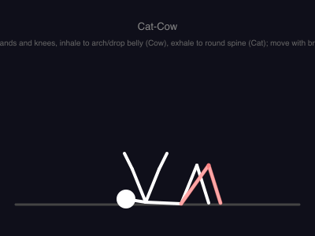
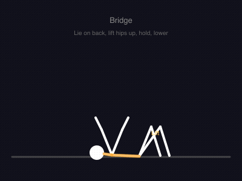
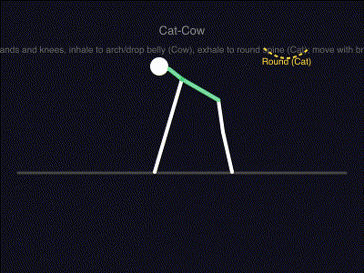
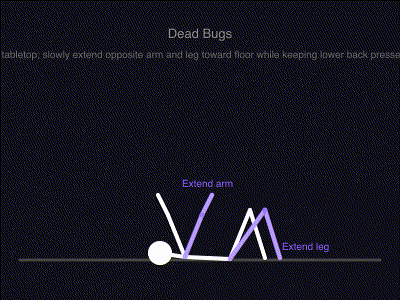
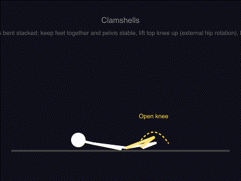
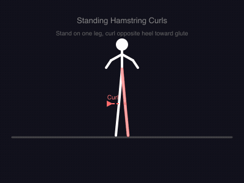
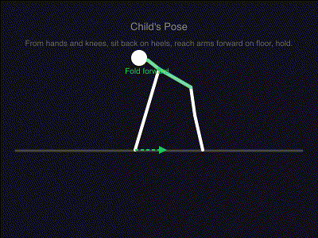
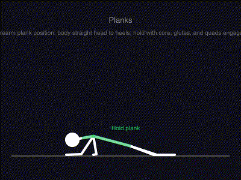
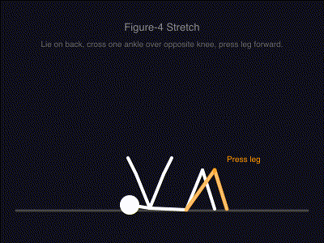
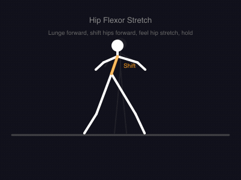

# Exercise Animations

Stick figure exercise animations in SVG frame sequences + Lottie JSON for [BridgeRecovery](https://github.com/cbonoz/bridge-recovery).

All 46 exercises across 8 muscle groups are data-driven: each exercise is defined in [`animation-plan.json`](animation-plan.json) with posture, joint motion deltas, action annotations, equipment, difficulty, breathing cues, form cues, and common errors. The generator interpolates joint positions over 72 frames (3s at 24fps).

## Quick Start

```bash
npm run generate    # render all 46 exercises (72 frames each)
npm run validate    # run 24 quality checks (key-frame sampled, ~14x faster)
npm run validate    # also generates HTML report at assets/preview/validate-report.html
npm run preview     # local preview at http://localhost:3001
```

## Examples

| Hamstring Slide | Bridge | Cat-Cow | Dead Bugs | Clamshells |
|:---------------:|:------:|:-------:|:---------:|:----------:|
|  |  |  |  |  |

| Standing Hamstring Curl | Child's Pose | Plank | Figure-4 Stretch | Hip Flexor Stretch |
|:-----------------------:|:------------:|:-----:|:-----------------:|:------------------:|
|  |  |  |  |  |

> Preview all 50 exercises locally: `npm run preview` → [http://localhost:3001](http://localhost:3001)
> Grid loads 12 frames per card; fullscreen loads all 72 at 24fps. GIFs above cycle 12 frames at 12fps.

## Structure

```
animation-plan.json       ← exercise catalog + generator docs + all 50 definitions
assets/
  animations/              ← 50 exercise directories, each with 72 SVGs + lottie.json
  preview/                 ← animated GIFs + HTML validation report
    hamstring-slide.gif
    bridge.gif
    ...

scripts/
  generate.js             ← data-driven renderer (reads JSON, posture templates, motion defs)
  preview.js              ← local preview server with 12-frame grid + 72-frame fullscreen
  validate.js             ← 19 quality checks (key-frame sampled, HTML report output)
```

Each exercise directory contains:
- `frame-000.svg` through `frame-071.svg` — individual frames at 400×300
- `lottie.json` — minified Lottie image-sequence (4.2KB avg, 57% smaller than pretty-print)
- `index.html` — standalone browser viewer

## Architecture

### How It Works

1. **7 posture templates** define the base stick figure skeleton (joint positions per posture)
2. **Each exercise** specifies a `posture`, optional `rest` offsets (exercise-specific start pose), `move` deltas (animation range), and `highlight` segments
3. **The generator** interpolates each joint from rest to max over 72 frames using easeInOut
4. **Annotations** from `animation-plan.json` are rendered per frame (arrows, arcs, or text labels)
5. **Lottie JSON** wraps the 72 frames as an image sequence for lottie-react-native

### Posture Templates

| Posture | Canvas layout | Used By |
|---------|--------------|---------|
| `supine` | Lying on back, head left | hamstring-slide, bridges, dead-bugs, pelvic-tilts, crunches |
| `prone` | Lying face down, head left | prone-hamstring-curl, planks, supermans |
| `all-fours` | On hands and knees, facing left | cat-cow, fire-hydrants, bird-dogs, glute-kickbacks |
| `side-lying` | Lying on side, head left | clamshells, side-planks |
| `standing` | Upright, vertical, facing right | standing-hamstring-curl, RDLs, marching, most balance/shoulder |
| `kneeling` | Upright on knees, facing right | nordic-curls, childs-pose, hip-flexor-stretch |
| `seated` | Sitting with legs forward | hamstring-stretch, pigeon-pose, 90-90-stretch |

Each template defines 12 joints: `head`, `neck`, `shoulder`, `hip`, `left_elbow`, `left_hand`, `right_elbow`, `right_hand`, `left_knee`, `left_foot`, `right_knee`, `right_foot` — connected by skeleton lines.

### Motion Definitions

Each exercise in `animation-plan.json` has a matching entry in `generate.js`'s `MOTIONS` object:

```
posture:      which template to use
rest:         joint offsets for the exercise-specific starting pose
move:         joint deltas during the animation (0 at rest, max at mid-cycle)
highlight:    skeleton segments to draw in the accent color
annotations:  labels read from animation-plan.json (arrow, arc, or text)
```

The animation cycle: `p = easeInOut()` goes 0→1→0 over 72 frames. At p=0 the figure is at `template + rest`. At p=1 it's at `template + rest + move`. At p=71 it's back at `template + rest`.

### Deterministic Figure Height

```
head_y = INSTRUCTION_Y(58) + HEAD_R(10) + MARGIN(5) = 73
```

The head center y for all vertical postures is computed from the instruction text baseline, ensuring the head circle top clears the text by 5px. This prevents text overlap and is enforced by the validator's `headClearance` check.

## Validate

```bash
npm run validate
```

Runs 19 quality checks across all 50 exercises. Motion/smoothness checks use **key-frame sampling** (frames 0, 18, 36, 54, 71) for speed. An **HTML report** is generated at `assets/preview/validate-report.html`.

| Check | What it catches |
|-------|----------------|
| `frameCount` | All 72 frames present |
| `svgValidity` | Unescaped `&`, mismatched tags |
| `structure` | Inconsistent element counts across frames |
| `labels` | Annotation labels that pop in/out mid-cycle |
| `connectivity` | Disconnected skeleton joints |
| `limbLengths` | Static segments that unnaturally stretch/shrink |
| `cycleClosure` | Frame 71 loops back to frame 0 |
| `motion` | Near-static animations (checks both endpoints, key-frame sampled) |
| `smoothness` | Sudden frame-to-frame jumps (key-frame sampled) |
| `orientation` | Spine angle matches exercise posture |
| `floorContact` | Appendages under floor or body floating (posture-specific tolerance) |
| `textOverlap` | Head circle enters instruction text render zone |
| `bounds` | Joints outside 400×300 canvas |
| `lottie` | Valid Lottie JSON with all 72 assets |
| `proportions` | Extreme segment length disparities |
| `ghostAlignment` | Active skeleton matches ghost at rest (allows rest offsets up to 40px) |
| `headClearance` | Head center y meets deterministic formula |
| `jointOrientation` | Knee position relative to hip (all-fours/kneeling/standing) |

### Interpreting Results

```
Pigeon Pose (pigeon-pose) [19/19]
  ✗ textOverlap: Head extends into text zone
```

- Validator **only shows failures** by default (passing checks are hidden for cleaner output)
- Score is `[passCount/19]` — all pass = no output
- HTML report at `assets/preview/validate-report.html` shows all results visually
- A score of `[18/19]` still generates usable frames — the validator flags regressions

## Preview Tips

```bash
npm run preview     # starts at http://localhost:3001
```

- Grid shows all 50 exercises grouped by muscle group
- Each card plays 12 frames at 24fps (every 6th frame)
- **Click any card** to open fullscreen with all 72 frames at 24fps
- **Press Esc** or click ✕ to close fullscreen
- Scroll to browse all 8 muscle groups

## Adding a New Exercise

1. **Add metadata** — Add an entry to `animation-plan.json` with:
   - `posture`, `instruction`, `description`, `motionHint`
   - `annotations` array describing the key action(s)
   - `touchFloor`, `ghost`, `active` fields

2. **Add motion definition** — Add an entry to `MOTIONS` in `scripts/generate.js`:
   - `posture` — which template to use
   - `rest` — joint offsets for the starting pose (if different from template)
   - `move` — joint deltas for the animation
   - `highlight` — which skeleton segments to color

3. **Generate and validate**:
   ```bash
   npm run generate
   npm run validate
   ```

4. **Preview**:
   ```bash
   npm run preview
   ```

The system is designed for AI generation: give an LLM an existing motion definition from `generate.js` plus the `animation-plan.json` entry, describe the new movement, and it can produce both. Paste back and run `npm run generate && npm run validate` to verify.

### Available Joints (for rest/move deltas)

| Joint | Description |
|-------|-------------|
| `head` | Circle center — use for nodding/tilting |
| `neck` | Between head and shoulder |
| `shoulder` | Top of spine / arm connection |
| `hip` | Bottom of spine / leg connection |
| `left_elbow` / `right_elbow` | Mid-arm (use `null` if template has no elbow) |
| `left_hand` / `right_hand` | Hand/foot of front arm/back leg |
| `left_knee` / `right_knee` | Mid-leg |
| `left_foot` / `right_foot` | Foot end (or `null` if not drawn) |

### Joint Delta Format

```js
// Each delta: { x: number, y: number } — pixels offset from template position
// Positive x = right, Positive y = down (SVG coordinates)
move: {
  hip: { x: 0, y: -55 },   // hip lifts 55px
  shoulder: { x: 0, y: -19 },
  neck: { x: 0, y: -8 },
  head: { x: 0, y: -4 },
}
```

### Annotation Types

```js
// Arrow: horizontal directional arrow (always points right)
{ type: 'arrow', x1: 200, x2: 280, y: 235, color: '#FFD93D', label: 'Slide', labelY: 228 }

// Arc: curved path that follows a joint (rotational motion)
{ type: 'arc', joint: 'head', dx: 140, dy: 0, yOff: 15, color: '#FFD93D', label: 'Arch' }

// Text: label that follows a joint's position
{ type: 'text', joint: 'right_hand', dx: -30, dy: -8, color: '#8B5CF6', text: 'Extend arm' }
```

## Usage in BridgeRecovery App

1. Copy the exercise directory (`assets/animations/<exercise-id>/`) into the RN app's asset bundle
2. Each directory contains `lottie.json` (Lottie v5.7.0) referencing all 72 SVG frames as image assets
3. Render with `lottie-react-native` using the standard Lottie component

The Lottie JSON format uses a pre-composition layer cycling through 72 image assets (one per frame) at 24fps. The SVG frames are self-contained (no external references) and render at 400×300 with dark background.
